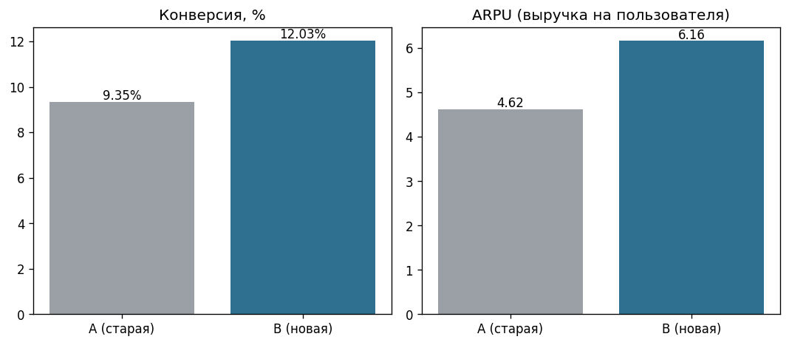

🇷🇺 [Русская версия](README.md)

# A/B Test: New Page vs Old (Python, statistics)

A/B test analysis for an online store: **statistical hypothesis testing** in Python.
The question - is the new page version really better, or is the difference just chance?

## Goal
We test a new page version (**B**) against the old one (**A**). The task is to verify
**statistically** whether B increases conversion and revenue, or the observed
difference is just sampling noise.

## Data
`ab_test.csv` - 10,000 users: `group` (A/B), `converted` (0/1), `revenue`.

## Method
- **Conversion** (proportion) → **two-proportion z-test** + 95% confidence interval.
- **ARPU** (revenue per user, numeric) → **Welch's t-test**.
- Significance level **α = 0.05**.

## Results
| Metric | A (old) | B (new) | Test | p-value | Significant? |
|---|---|---|---|---|---|
| Conversion | 9.35% | 12.03% | two-proportion z-test | 0.000014 | Yes |
| ARPU | 4.62 | 6.16 | Welch's t-test | 0.000002 | Yes |

- Conversion lift: **+2.68 pp** (95% CI [1.47; 3.89]) ≈ **+29%** relative.
- Both metrics are significantly higher for the new page.

## Conclusion & recommendation
The new page **B significantly** improves both conversion and revenue per user
(p < 0.001 for both metrics). **Recommendation: roll out B to all users.**
